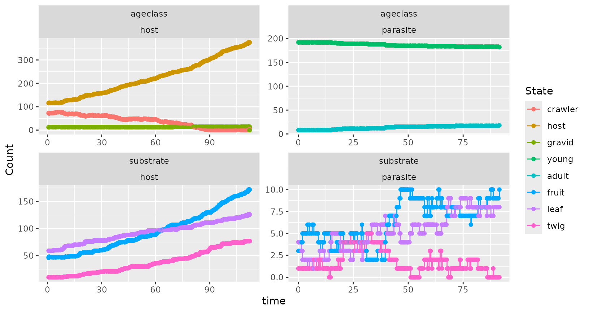
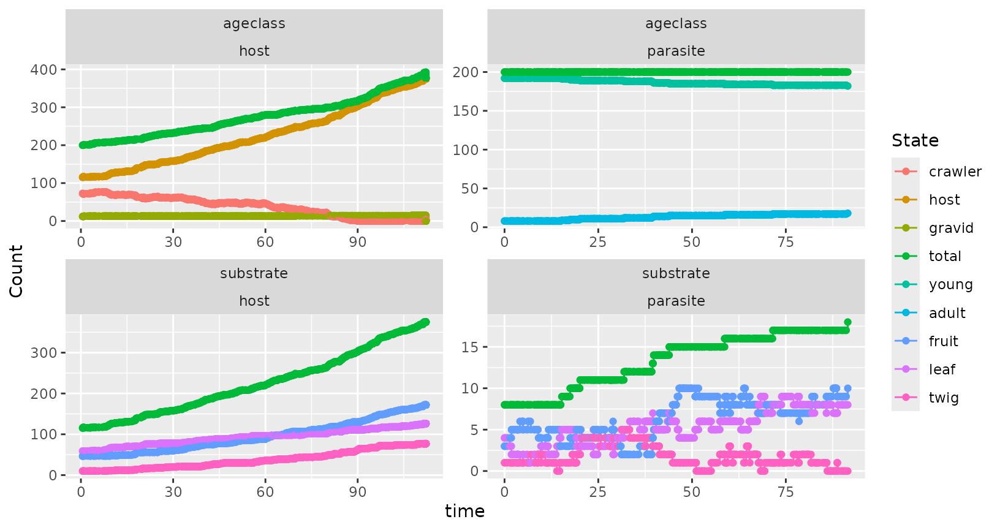
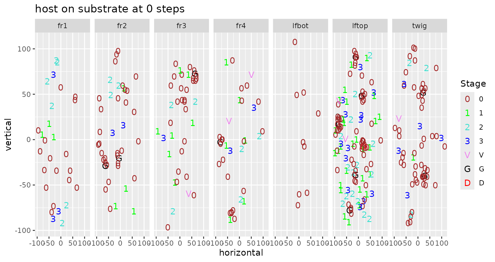
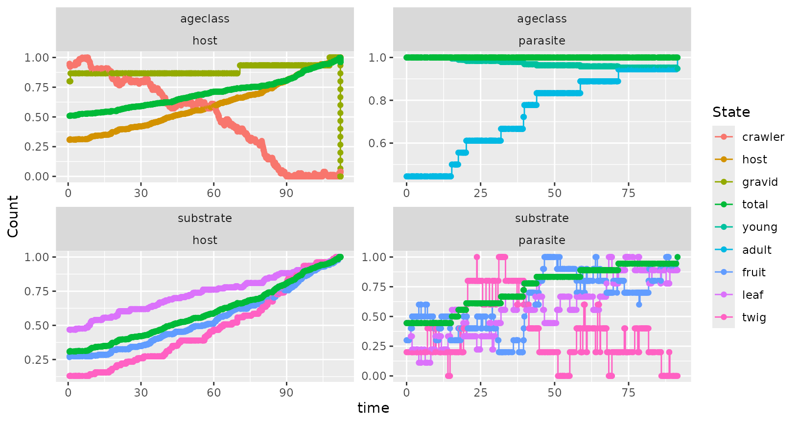
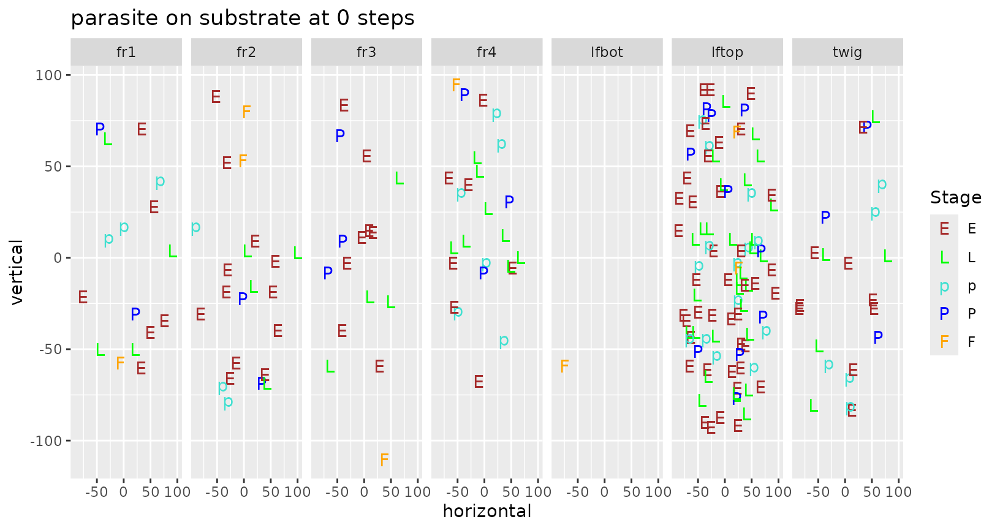
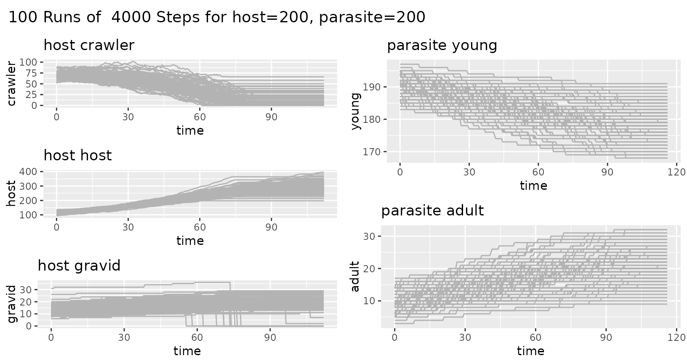
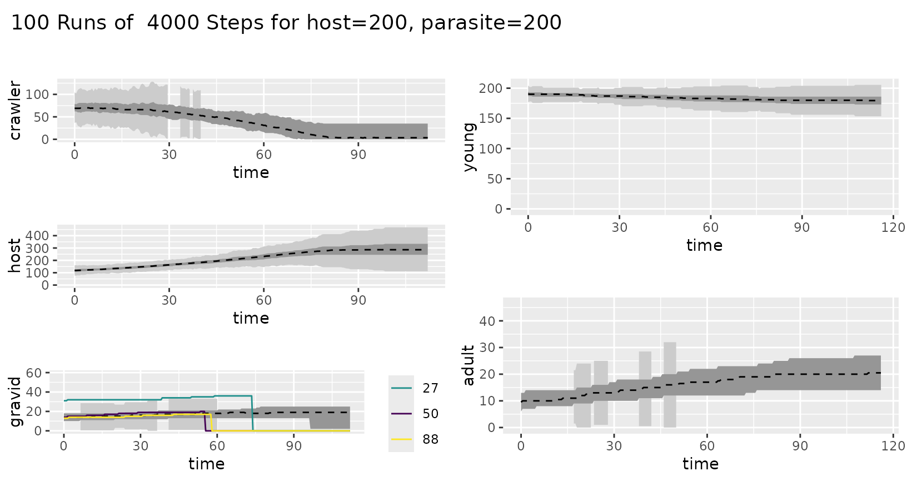
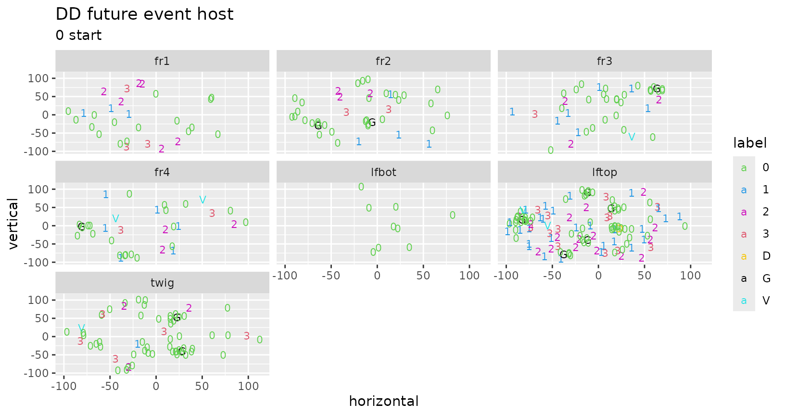
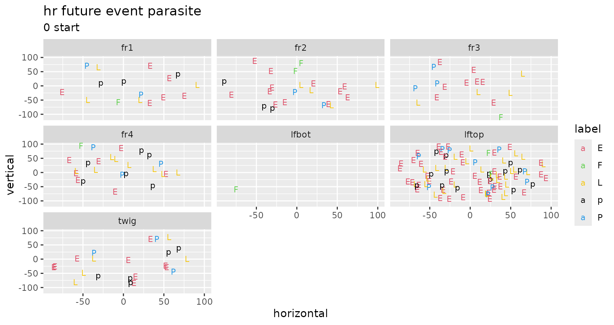
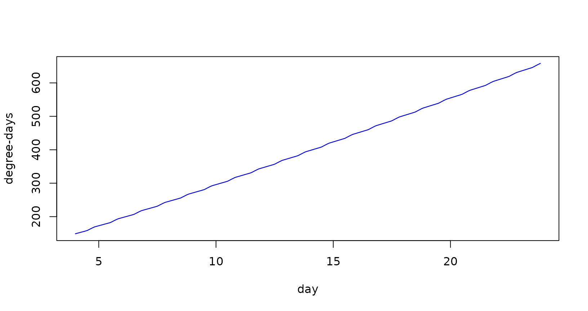

# Ewing Individual-Based Modeling

``` r

library(ewing)
#> Registered S3 method overwritten by 'e1071':
#>   method       from
#>   print.fclust GET
```

### Modular approach

This was developed 18 Nov 2002 and updated 10 Aug 2022.

A big change is that I have modularized things. The default species are
now “host” and “parasite”. There is a second library called
“[redscale](https://github.com/byandell/redscale)” that has redscale and
aphytis and comperiella and encarsia. (Actually, host is just redscale,
and parasite is just aphytis). Now you can set up a new system by just
creating a new library package.

The second big change is that I use R conventions of passing arguments,
rather than hiding things as I have done in the past. Now you do

``` r

mysim <- init.simulation(interact = FALSE)
#> Data organism.features already loaded
#> Initializing Temperature Profile ...
#> Data temperature.par already loaded
#> Data temperature.base already loaded
#> Base daily temperature fluctuation:
#> Temperature set for days 0 to 202 
#> Daily low temperature range: 68 to 77 
#> Daily high temperature range: 83 to 92 
#> Run temp.design() to adjust temperature range
#> Initial active temperature:
#> lo.hour hi.hour 
#>       0      24 
#> Creating simulation organism set using species:
#>  host, parasite 
#> 
#> Data future.host already loaded
#> Data substrate.host already loaded
#> Data future.parasite already loaded
#> Data host.parasite already loaded
#> Data substrate.parasite already loaded
#> Data substrate.substrate already loaded
#> 
#> Initialize host at size 200...
#> Initializing events for host with 200 individuals
#> Initialize parasite at size 200...
#> Initializing events for parasite with 200 individuals
```

``` r

simres <- future.events(mysim, refresh = 1000, plotit = TRUE)
#> initial: host 200: parasite 200
#> lo.hour hi.hour 
#>       0      48 
#> refresh 1000: host 320: parasite 200
#> refresh 2000: host 457: parasite 200
#> refresh 3000: host 457: parasite 200
#> refresh 4000: host 457: parasite 200
```

``` r

simres <- future.events(mysim, plotit = FALSE)
#> initial: host 200: parasite 200
#> lo.hour hi.hour 
#>       0      48 
#> refresh 200: host 234: parasite 200
#> refresh 400: host 262: parasite 200
#> refresh 600: host 280: parasite 200
#> refresh 800: host 304: parasite 200
#> refresh 1000: host 324: parasite 200
#> refresh 1200: host 359: parasite 200
#> refresh 1400: host 378: parasite 200
#> refresh 1600: host 378: parasite 200
#> refresh 1800: host 378: parasite 200
#> refresh 2000: host 378: parasite 200
#> refresh 2200: host 378: parasite 200
#> refresh 2400: host 378: parasite 200
#> refresh 2600: host 378: parasite 200
#> refresh 2800: host 378: parasite 200
#> refresh 3000: host 378: parasite 200
#> refresh 3200: host 378: parasite 200
#> refresh 3400: host 378: parasite 200
#> refresh 3600: host 378: parasite 200
#> refresh 3800: host 378: parasite 200
#> refresh 4000: host 378: parasite 200
```

``` r

plot(simres, substrate = FALSE)
```


``` r

plot(simres, total = FALSE, normalize = FALSE, substrate = FALSE)
```



``` r

plot(simres, normalize = FALSE, substrate = FALSE)
```



``` r

plot(simres, ageclass=FALSE)
#> [[1]]
```



    #> 
    #> [[2]]


``` r

plot(simres, substrate = TRUE)
#> [[1]]
```



    #> 
    #> [[2]]


    #> 
    #> [[3]]



The object “mysim” has the initial populations and the organism and
temperature structures. The object “simres” has the populations after
running future.events (used to be step.future), along with summary
information from the run.

I have also modularized the immediate, pending and future events. The
functions

    event.birth birth immediate event
    event.attack    attack immediate event
    event.death death pending event
    event.future    generic future event

You can supply your own version of these if you don’t like mine. And you
can add new ones by making appropriate changes in the “event” column of
the future.host and future.parasite column. Adding a new kind of event,
such as migrate means the routine now looks for a routine called
“event.migrate”. Also, event.attack uses the type of parasite
(endo,ecto) and the actual event (feed,ovip) to look for routines like
event.ecto.feed to process attack details.

### Multiple Simulation Runs

``` r

data(simdata)
```

``` r

summary(simdata)
#> 100 Runs of  4000 Steps for host=200, parasite=200
#> # A tibble: 10 × 8
#>    species  item        r central    lo    hi whisker.lo whisker.hi
#>    <chr>    <chr>   <dbl>   <dbl> <dbl> <dbl>      <dbl>      <dbl>
#>  1 host     crawler     0    69      62    79       36.5      104. 
#>  2 host     crawler   112     3.5     0    35      -52.5       87.5
#>  3 host     host        0   118     108   129       76.5      160. 
#>  4 host     host      112   286     245   334      112.       468. 
#>  5 host     gravid      0    14      10    18       -2         30  
#>  6 host     gravid    112    19       2    25      -32.5       59.5
#>  7 parasite young       0   190.    187   194      176.       204. 
#>  8 parasite young     116   180.    173   186      154.       206. 
#>  9 parasite adult       0     9.5     6    13       -4.5       23.5
#> 10 parasite adult     116    20.5    14    27       -5.5       46.5
```

``` r

ggplot_ewing_envelopes(simdata)
```



``` r

ggplot_ewing_envelopes(simdata, confidence = TRUE)
#> Warning: Removed 152 rows containing missing values or values outside the scale range
#> (`geom_ribbon()`).
#> Warning: Removed 125 rows containing missing values or values outside the scale range
#> (`geom_ribbon()`).
#> Warning: Removed 192 rows containing missing values or values outside the scale range
#> (`geom_ribbon()`).
```



### Other plots

``` r

ggplot_current(simres, "host")
```



``` r

ggplot_current(simres, "parasite")
```



##### Plot to relate day to degree-day based on temperature regime.

``` r

temp.plot(simres)
```



##### Interactive

These plots show splines use
[`graphics::locator()`](https://rdrr.io/r/graphics/locator.html) to
adjust nodes.

The routines `five.plot()` and `five.show()` are two different versions
of an interactive study of the 5-parameter relationship of time and mean
value.

``` r

five.plot()
```

``` r

five.show()
```

interactive design plot for high and low temperatures. Uses
[`graphics::locator()`](https://rdrr.io/r/graphics/locator.html).

``` r

temp.design(simres)
```

## Inner workings of ewing simulation

Simulations are driven by flat files that declare the species, their
relationships with each other and with the model substrate, and the
details of scheduling future events for individuals. There are also
files that specify the temperature regime, which is important if species
respond to degree-day (`DD`) cues rather than temporal cues; this aspect
is only briefly developed (see some plot ideas above) and will not be
discussed further below. Here we use the default files in the `data`
part of this package.

These simulations keep track of the current stage and next scheduled
future event for every individual. That is, these simulations are
individual-based rather than population-based. It is useful (such as for
plots and other summaries) to collapse over individuals to get
population trends, but impossible to reverse this without unrealistic
assumptions. To that end, summary information at the population level
(say by species life stages) are accumulated during the simulation, and
later simplified for plots and tables.

This simulation is set up so that names of species, their stages, and
subtrates are taken from the flat tables rather than being hardcoded.
They are not limited to two species, although ultimately interactions
are dyadic (two individuals) and monadic choices of future trajectories
come down to competing risks for individuals.

### Initialization

One begins a simulation by initializing all species. The
`organism.features` table specifies multiple features of the simulated
community. The `units` specify whether a species’ internal close is
regulated by the hour (`hr`) or by degree-day (`DD`). The `offspring` is
either a Poisson mean number (for a `host` species) or the name of the
`host` species (for a `parasite` species). Similarly, `attack` is set to
the `host` species for a `parasite` or NA if species is not a
`parasite`. The `parasite` column specifies the type of parasite (`ecto`
or `endo`; NA if not a parasite).

The `deplete` is the inverse of the depletion rate over time for
individuals in species relative to time units that have passed. That is,
the depleteion rate = (time lapse of event ) / `deplete` (leading of
course to death unless the individual `feed`s. For species that are not
parasites, the `birth` column has the stage when births occur (`gravid`
for `host`).

Individuals in a species may move across a `substrate`. Which ageclass
(`subclass`) of a species moves across the `substrate`? (`host` for
`host` and `adult` for `parasite`; used for counting) and which stage of
a species can actually `move` along the `substrate`?

Each species has a future event scheduling table (`future.host` and
`future.parasite`). The `init` column specifies the relative weight of
`current` stages for simulating the initial population.

### Future events and competing risks

Each row of a future event scheduling table has possible `future` events
from a `current` stage in the life of an individual of that species. The
`fid` points to the row in this table corresponding to the `future`
stage. The code uses numeric `fid` because it ends up in a vector of
other numeric values. An individual in a species will progress from
`current` to `future` stage when its event time is at the top of the
event queue, unless some interaction leads to a change for that
individual. The `future` event time is scheduled using the `time` entry.
When an individual is at the top of the event queue, the `future` event
time is scheduled using a spline interpolation with mean from the `time`
value. If the species uses hours (`hr`), the spline is just a straight
line, but if it uses `DD` the spline uses information from the
`temperature` profile for the simulation (again, not discussed here
yet).

Note that sometimes there are multiple rows with the same `current`
value, which are competing risks. For instance `future.host` has
competing risks from the `current` stage `second.3` of becoming `female`
or `male`, while `future.parasite` has competing risk from the current
stage `adult` to `feed` or `ovip`osit, with return lines from `feed` and
`ovip` to `adult`. That is, an adult parasite might feed or oviposit,
which have different health and population consequences: feeding
prolongs life while ovipositing produces new offspring and depletes
life.

All individuals have a `current` stage and are organized into an event
queue, which is a triply-linked leftist tree, based on the scheduled
time for their next `future` event. Each species has its own leftist
tree, with the tops of those trees identifying the individuals with the
closest (in time) next `future` event. Internal routine `put.species`,
in conjuction with `leftist.update`, `leftist.remove` or
`leftist.birth`, modify the leftist trees when there is an individual
event update, death (remove) or birth(s), respectfully.

### Plots and summaries

Plots used the plot character (`pch`), `color` (for stage) and
`ageclass` (for summary grouping). The `event` column is useful for
summary tables and plotting, and sometimes for other categorization
(such as distinguishing `birth` and `death` from other types of `future`
events).

### Substrates and movement around triangular grid

This simulation system allows for individuals to be dispersed across a
set of `substrate`s and to move within and between `substrate` elements.
Currently, each `substrate` is designed on a triangular coordinate
system of interconnected triangles with diameter of 10 units (hardwired
in internal routine `event.move`). Connectivity of `substrate` segments
is determined by table `substrate.substrate`, while movement options for
species are determined by species tables (`substrate.host` and
`substrate.parasite`). `substrate` elements may have sides (`1,2,3,4`
for `fruit`, and `top`, `bottom` for `leaf`). Relative weights for
movement are specified for `init`ial position, chance of a `parasite` to
`find` a `host`, and choice to `move` among `substrate` elements. The
last columns of the `substrate` species tables give the relative weight
of moving from the current `substrate` to one of the other substrates.

The triangular grid and approximations used herein capture most (~95%)
of movement while simplifying calculations to max and min primarily
rather than using quadratic calculation needed for a rectangular
coordinate system (where the Pythagorean theorem rules).

### Excel input data file

Users can supply and input data file to modify the simulation setup. In
consists of the following sheets:

- control sheet naming species, substrates, and key simulation
  parameters
  - `organism.features`
- future event sheets
  - `future.host`, `future.parasite` (one per species; substitute name
    used in `organism.features`)
  - `host.parasite` (one per each species interaction)
- substrate movement sheets (currently only one substrate allowed)
  - `substrate.host`, `substrate.parasite` (one per species; substitute
    name used in `organism.features`)
  - `substrate.substrate` (connectivity of substrate components)
- temperature sheets
  - `temperature.base`, `temperature.par`

There are specific, fragile, constraints for naming of and within these
sheets. Here are the “rules”:

- organism names (first column or rownames of `organism.features`) must
  agree with the names for future event and substrate movement sheets
  - default: `host` must match sheet names `future.host` and
    `host.parasite`
  - default: `parasite` matches sheet names `future.parasite` and
    `host.parasite`
- parasites are identified by several things
  - entry `ecto` or `endo` in column `parasite` of `organism.features`
    (NA for non-parasites)
  - entry `host` (substitute name of host) in column `offspring` and/or
    `attack` (NA for non-parasites; name is not currently checked to
    match name of a possible host)
  - the word `parasite` (substitute name of parasite) must be in the
    rownames of the `host.parasite` (substitute names of host and
    parasite) sheet
- non-parasites (such as hosts) are identified by several things
  - `birth` column of `organism.features` needs valid `current` stage
    from non-parasite future event sheet
  - default: `gravid` matches entry in `current` column of `future.host`
    sheet
  - `offspring` column of `organism.features` has number (default: `20`
    for `host`)
  - `attack` column of `organism.features` is empty (NA)
  - empty (NA) in column `parasite` of `organism.features` (`ecto` or
    `endo` for parasites)
- `subclass` column of `organism.features` must match valid `ageclass`
  of each species
  - default: `host` matches `ageclass` entry in `future.host`
  - default: `adult` matches `ageclass` entry in `future.parasite`
  - smaller: `grown` matches `ageclass` entry in `future.host`
  - smaller: `forager` matches `ageclass` entry in `future.parasite`
- `move` column of `organism.features` must have valid `current` stage
  for each species
  - default: `crawler` matches `current` entry in `future.host`
  - default: `adult` matches `current` entry in `future.parasite`

### Redscale thoughts

The fields are mostly self-explanatory. DD represents mean degree days
to that future event. Thus the mean time to “virgin” from “third.3” is
560-465=95 DD. The next two fields concern the Aphytis parasite,
comprising the relative risk of being killed by an Aphytis that is
feeding or is laying eggs, respectively. There was no explicit
information on feeding risk, so these are made up following Luck’s
papers. The egg-laying risks are directly from the IPM pamphlet. The
next two fields have the relative risks for the other two parasites.
Then follows the gender (only females modeled here). The next field has
the plotting symbol (pch), followed by the plotting color. The last and
most important column is the life stage.

## Scaling up

The beginning simulations use hundreds of individuals and thousands of
simulation steps, as well as tens or hundreds of replicate simulations.
Theoretically, it should be possible to scale simulations up to hundreds
of thousands of individuals through some attention to loosely coupled
systems and GPUs. At small population sizes, these simulations may shed
new light on shortcomings of population-based simulations, but it is in
large scale that they have the potential to provide useful insights for
systems-level study.

It is useful to note that the simulation steps through events rather
than time. Hence time is a function of events. Only in retrospect can
the linear time sequence, and population numbers, be measured. Further,
the relationship between steps and time is nonlinear, so that many steps
may cover only a short time span, or a few steps may traverse much time.
Further, different species may have a different relationship of steps to
time. That is, the resolution for a species is set by the granularity of
events and their mean time duration. The span of the simulation is
determined by the number of allowed steps, and may result in different
spans for different species, when taking into account the unrealized
`future` events that remain in the community at the time of simulation
stop.
