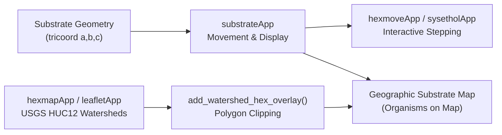

# Substrate Geometry

This document details the tridiagonal triangular coordinate system
$`(a, b, c)`$, substrate network topology, unit coordinate rescaling
($`[0, W_{sub}]`$), discrete 6-sided hexagonal polygon tile generation,
and spatial organism movement visualization modules.

------------------------------------------------------------------------

## 1. Tridiagonal Coordinate System & Cartesian Transformation

This document outlines the triangular coordinate system used in the
`ewing` simulation package for modeling substrates and organism
movement, as described in the `vignettes/ewing.Rmd` and implemented via
the `substrate.*.txt` files.

## Prompts

Start a new document inst/doc/refactor/triangle.md. This will be used to
document the triangular coordinate system described in
`vignettes/ewing.Rmd` subsection “Substrates and movement around
triangular grid”. Refer also to `data/substrate.*.txt` files. Add to
this discussion of `R/triangle.R` routines and their use (notably
`rtri()`) in other R routines.

## Overview

The `ewing` simulation system allows individuals to disperse across a
set of interconnected `substrate` elements. This environment is
structured upon a triangular coordinate system.

The triangular grid captures the majority (~95%) of movement dynamics
while significantly simplifying computational overhead. Approximations
using minimum and maximum calculations replace the more intensive
quadratic (Pythagorean) calculations that would be necessary in a
standard rectangular coordinate system.

Each substrate patch on the grid is modeled as an interconnected
triangle, with an effective diameter of 10 units (hardwired in the
internal routine `event.move`).

## Substrate Connectivity (`substrate.substrate`)

Connectivity between different substrate segments is determined by the
interaction matrix defined in `data/substrate.substrate.txt`.

For example, a typical grid consists of fruits (`fr1`, `fr2`, `fr3`,
`fr4`), `twig`, and leaves (`lftop`, `lfbot`), with the configuration
indicating pairwise connections. A value of `1` signifies an available
path between components, whereas `0` (typically the diagonal) meaning no
self-loop transition is explicitly defined on the graph level.

## Organism Movement Arrays (`substrate.host` and `substrate.parasite`)

Movement options and biases for species traversing the grid are directed
by the `data/substrate.host.txt` and `data/substrate.parasite.txt`
matrices.

These tables parameterize:

- **`substrate`**: The type of substrate component (e.g., `fruit`,
  `twig`, `leaf`).
- **`side`**: Substrate elements may have complex, multi-sided
  topographies. For instance, fruits might have sides `1, 2, 3, 4`, and
  leaves may be categorized into `top` and `bottom`.
- **`init`**: Relative weight determining the probability of an
  individual’s initial placement on this element.
- **`find`**: The relative probability parameter related to a parasite
  finding a host.
- **`move`**: The relative weight dictating the probability an
  individual will choose to traverse from the current element.
- **Relative Destination Weights**: The final columns (e.g., `fruit`,
  `twig`, `leaf`) specify the comparative preference/weight of an
  organism transitioning from its current substrate to an adjacent one
  of the specified type.

By configuring these text files, users can fully customize the graph of
the environment, establishing behavioral traits like affinity to
specific plant structures (e.g., parasites preferring the top of a leaf
compared to the underside) or aggregation dynamics.

## Implementation of Tridiagonal Coordinates (`R/triangle.R`)

The mathematical backing of the triangular coordinate system resides in
`R/triangle.R`, converting simulation parameters into physical space.
The fundamental characteristic of the tridiagonal system is that
coordinates consist of three axes values ($`a, b, c`$) which
intrinsically sum to zero ($`a + b + c = 0`$). Note that the terms
`triangle`, `tridiagonal`, and `tri` are used interchangeably in the
codebase to reference this same 3-axis space.

### Core Routines

- **`rtri(n, width, tri, roundoff)`**: Generates randomized adjustments
  to coordinate positions for $`n`$ individuals. Within the spatial
  dimension bounds `[0, width]`, it calculates randomized uniform
  variable transformations onto the 3 tridiagonal axes.
- **`car2tri(xy)`** and **`tri2car(tri)`**: Helper transformation
  matrices parsing objects between conventional 2D Cartesian ($`x,y`$)
  mappings and the native tridiagonal format ($`a, b, c`$). This
  translation is especially helpful for downstream plotting limits
  (`plot.current`) or interactions needing euclidean geometric
  interpretations.
- **`tridist(tri)`** and **`cardist(xy)`**: Evaluate distance in 3-axis
  versus 2-axis formats. Distance in triangular bounds computationally
  reduces to retrieving the `max` value of the matrices across an axis,
  further enabling performance optimizations mentioned earlier (~95%
  approximation with minimum processing cost).

### Usages within Simulation State

The coordinate engine interacts closely with initialization and organism
event handling:

- **`R/init.population.R`**: During baseline generation via
  [`init.population()`](https://byandell.github.io/ewing/reference/init.population.md),
  an initial positional dispersion on the substrate space is computed
  utilizing `rtri(n, width = 100)`. Thus, individuals manifest randomly
  displaced throughout the substrate plane up to a radius of 100 units
  prior to assignment to nodes `pos.a`, `pos.b`, and `pos.c`.
- **`R/move.R`**: Individuals progressing to an `event.move` scheduled
  activity can hop across the substrate grid. Assuming they do not
  transfer directly entirely between disjoint components (`sub.future`),
  their physical step size traversing within their local substrate
  updates via `rtri(n, width = 10)`. This encapsulates standard
  micro-movements of scale 10 simulation units.

## Substrate Triangle Reconstruction

### Prompts

Develop an R script under `inst/scripts/substrate_triangle.R` to
programmatically reconstruct the tridiagonal grid image from
`Documents/plant_triangle.jpg`. The image depicts a network composed of
8 connected triangles: `lftop`, `lfbot`, `tw1`, `tw2`, `fr1`, `fr2`,
`fr3`, and `fr4`.

Instead of using random noise generation via `rtri()`, we will generate
a regular geometric lattice using native triangular coordinates
$`(a, b, c)`$, and apply topology offsets to map the interconnected
substrate shapes.

### Walkthrough

- **Fixed `car2tri.default` (`R/triangle.R`)**: Discovered and patched a
  silent matrix dimension bug. `rbind(x, y)` was improperly generating a
  `2xN` matrix instead of the expected `Nx2` matrix. This caused parsing
  errors and translation failures in the tridiagonal coordinate
  conversions. The function now appropriately runs `cbind`, feeding
  correctly oriented memory to `car2tri()`.
- **Created `substrate_triangle.R`**: Added the new tridiagonal
  topological visualization tool `inst/scripts/substrate_triangle.R`.
  This tool generates a localized mesh array $`(a, b, c)`$ modeling
  interlocking geometries for standard upward and downward component
  orientations, correctly restricted to precisely 10 dots per edge using
  mathematical delta `- step` adjustments.
- **Topology Mappings**: Formulated a refined tridiagonal topology
  matrix spanning the visual plane. This explicitly builds the hexagonal
  layout dictated by the adjacency limits, positioning `fr2` as the
  downward central triangle seamlessly abutting (`fr1`, `fr3`, `fr4`),
  and sequentially attaching the `twig` and `leaf` modules to form
  proper continuous branches without empty grid gaps.
- **Visual Overlays & Alignment**: In addition to resolving a 1-dot
  alignment slip (calibrating the adjacency anchors exactly to the
  offset bound distances `W = 9`), the structure generates explicit
  bounding polygons spanning the substrate borders with black outer
  lines. Finally, it dynamically calculates side boundary midpoints and
  interpolates them 25% inward towards the substrate centroid to
  properly overlay the `1, 2, 3` numeric axis boundary identifiers right
  inside their respective sides.

By passing the aggregate topology to the package’s internal `tri2car()`
geometry transformer, the code accurately maps the layout to
standardized Euclidean spatial data $`(x,y)`$ enabling robust
visualization.

### Object-Oriented Refactoring

To maximize reusability across the simulation suite, the core
construction loops from the prototype script have been completely
abstracted into the package’s source directory under
`R/substrate_triangle.R`. This explicitly decouples the network
structure into formal functional operations:

- `substrate_topology(width, step)`: Isolates mathematical configuration
  offsets and coordinate boundary limits globally. We explicitly
  transitioned away from “plant” nomenclature to the “substrate”
  standard to support generalized interaction meshes.
- `create_substrate(topology, width, step)`: Iterates across the defined
  configuration to compute analytical geometry components (extracting
  Euclidean mesh dots, defining polygon bounds via topological vertices,
  and interpolating numerical boundary indicators automatically).
  Returns an S3 object of format `class = "substrate"`.
- `autoplot.substrate(object)`: Implements a scalable visual overlay
  handler utilizing `ggplot2`. Users can instantiate the tridiagonal
  substrate network internally and map it instantly utilizing native
  commands like `autoplot(my_substrate)`!

The `inst/scripts/substrate_triangle.R` script now exclusively invokes
these native package functions (via
[`library(ewing)`](http://www.stat.wisc.edu/~yandell/ewing)) to render
the reconstruction!

------------------------------------------------------------------------

## Interactive Substrate Network Explorer (`triangleApp`)

### Prompts

``` text
Use `inst/scripts/substrate_triangle.R` to create `R/triangleApp.R`. Create a `demos/triangleApp.qmd` for deployment. First create an Implementation Plan for approval.
Document in `inst/doc/refactor/triangle.md`.
```

### Architectural Rationale & Features

1.  **Interactive Substrate Grid Scaling (`width` & `step`):**
    - `triangleApp(width = 10, step = 1)` provides numeric inputs
      allowing users to dynamically scale substrate component radius
      (`width`) and grid dot density spacing (`step`).
    - Modifying `width` or `step` instantly recalculates the tridiagonal
      topology lattice (`substrate_topology`) and spatial geometry
      (`create_substrate`).
2.  **Modular Filtering & Layer Toggles:**
    - **Substrate Module Selector:** Users can select or remove
      individual plant components (`fr1..fr4` fruits, `tw1..tw2` twigs,
      `lftop..lfbot` leaves) using a multi-select tag list
      (`selectizeInput`).
    - **Display Layer Checkboxes:** Users can toggle individual
      graphical layers:
      - `Boundaries` (`geom_polygon` outlining substrate patch
        perimeters).
      - `Dots` (`geom_point` showing grid coordinate points).
      - `Labels` (`geom_text` displaying component center labels).
      - `Numbers` (`geom_text` displaying side edge numbers 1, 2, 3).
3.  **Substrate Statistics & Metrics Panel:**
    - A dedicated card displays real-time summary metrics:
      - Active module count vs. total available modules.
      - Total spatial coordinate dots across selected modules.
      - Extents spanning spatial $`X`$ and $`Y`$ dimensions.
      - Point density breakdown list per substrate patch.
4.  **Ultra-Compact Sidebar Design:**
    - Follows the tight side panel layout established in `tempApp.R`
      (side-by-side flex inputs, inline checkboxes, ~180px height),
      ensuring the sidebar aligns with the plot height and eliminates
      empty space.
5.  **Serverless Shinylive WebAssembly Deployment
    (`demos/triangleApp.qmd`):**
    - Includes standalone implementations of core substrate routines
      (`tricoord`, `tri2car`, `get_substrate_grid`,
      `substrate_topology`, `create_substrate`).
    - Indexed in `demos/index.qmd` (listing grid) and
      `demos/_quarto.yml` (navbar navigation).

------------------------------------------------------------------------

## Hexagonal Grid Overlay & Global Organism Positioning (`hexmoveApp`)

The tridiagonal substrate network engine has been expanded to map live
simulation organism coordinates directly onto hexagonal substrate grid
overlays:

- **Substrate Patch Resolution
  ([ewing_substrate](https://byandell.github.io/ewing/R/ewing_substrate.R#L44))**:
  Maps organism substrate stage indices `individual["sub.stage"]` to
  specific plant substrate elements (`fr1`, `fr2`, `fr3`, `fr4`,
  `twig`/`tw1`, `lftop`, `lfbot`).
- **Hexagonal Overlay Generation
  ([create_hex_overlay](https://byandell.github.io/ewing/R/substrate_triangle.R#L175))**:
  Constructs 6-vertex polygon tiles for each lattice dot in a
  `substrate` object, rendering discrete hexagonal cells across all
  substrate components (`fr1..fr4`, `tw1..tw2`, `lftop..lfbot`).
- **Per-Substrate Surface Coordinate Rescaling
  ([ewing_substrate](https://byandell.github.io/ewing/R/ewing_substrate.R#L60))**:
  Rescales organism local coordinates $`(pos.a, pos.b, pos.c)`$ into the
  unit triangle $`[0, W_{sub}]`$ of each active substrate patch
  (supporting custom substrate sizes $`W_{sub}`$ per surface). Applies
  topological offsets (`offset`) and orientations (`dir = "up"` or
  `"down"`), converting to global Euclidean $`(x, y)`$ coordinates via
  `tri2car()` so all organisms are visualized strictly within their
  designated substrate surface bounds.
- **Integrated Module Controls
  ([substrateApp](https://byandell.github.io/ewing/R/substrateApp.R#L35))**:
  Supports switching between `"hex"` (global hexagonal grid overlay) and
  `"facet"` (panel view faceted by substrate element), alongside action
  buttons for stepping through simulation events (`+1`, `+10`, `+100`
  steps).
- **Interactive Application
  ([hexmoveApp](https://byandell.github.io/ewing/R/hexmoveApp.R#L16))**:
  Composes `initParInput`, `initServer`, and `substrateServer` into an
  interactive exploration tool. See
  [hexmove.md](https://byandell.github.io/ewing/articles/tech_guide/hexmove.md)
  for full documentation.

------------------------------------------------------------------------

## 2. Substrate Movement Module Architecture (`substrateApp`)

## Overview

The primary goal of this refactoring pipeline is to utilize
**`substrateApp`** (`substrateInput`, `substrateOutput`,
`substrateServer`) to track and simulate organism movement across
substrate grid networks, establishing a foundation to project host and
parasite spatial positions onto real-world geographic maps identified
with **`hexmapApp`**.

------------------------------------------------------------------------

## Modular Integration Milestones

### 1. `sysetholApp` Integration (`R/sysetholApp.R`)

- **Sidebar Composition**: Replaced simplified/duplicated species
  display controls in `sysetholInput` with
  **`substrateInput("substrate")`**. Users can now adjust layout views
  (Hex Substrate Overlay vs Faceted Substrates), species modes (Overlay
  vs Separate), step densities, substrate radii, display layers
  (boundaries, hex grid, organisms, labels), and incremental step
  buttons directly within the Systems Ethology Platform.
- **Output Tab Composition**: Updated `sysetholOutput` to embed
  **`substrateOutput("substrate")`** inside the **Substrate Plots** tab.
- **Server Module Delegation**: Replaced ~45 lines of custom plotting
  code in `sysetholServer` with a clean call to
  **`substrateServer("substrate", simres = current_sim)`**.

### 2. `hexmoveApp` Modularization (`R/hexmoveApp.R`)

- **Exported Module Components**: Added and exported
  [`hexmoveAppInput()`](https://byandell.github.io/ewing/reference/hexmoveApp.md),
  [`hexmoveAppOutput()`](https://byandell.github.io/ewing/reference/hexmoveApp.md),
  and
  [`hexmoveAppServer()`](https://byandell.github.io/ewing/reference/hexmoveApp.md)
  in `R/hexmoveApp.R` and `NAMESPACE`.
- **Composable App Launcher**: Re-architected
  [`hexmoveApp()`](https://byandell.github.io/ewing/reference/hexmoveApp.md)
  to compose its sidebar and main panel directly from `hexmoveAppInput`,
  `hexmoveAppOutput`, and `hexmoveAppServer`, cleanly delegating spatial
  grid stepping and plotting to `substrateServer`.

### 3. Shinylive WebAssembly Demos (`demos/`)

- **WebAssembly Script Dependencies (`inc_files`)**: Expanded
  `inc_files` in both `demos/sysetholApp.qmd` and `demos/hexmoveApp.qmd`
  to include `R/triangle.R`, `R/community.R`, `R/Org.R`,
  `R/substrate_triangle.R`, `R/ewing_substrate.R`, `R/substrateApp.R`,
  and `R/sysetholApp.R` / `R/hexmoveApp.R`.
- **`get.species` & `Org` Fallbacks**: Updated `get.species` in
  `R/community.R` and `getOrgFuture`, `getOrgFeature`, `getOrgInteract`
  in `R/Org.R` with safe fallbacks for webR adapter objects (where
  `community$pop[[species]]$org` is present), resolving the Shinylive
  WebAssembly `'could not find function "get.species"'` runtime error.

------------------------------------------------------------------------

## Strategic Roadmap: Spatial Movement on Geographic Hexmaps



1.  **Phase 1 (Completed)**: Standardize `substrateApp` as the central
    organism movement visualizer and module across `sysetholApp` and
    `hexmoveApp`.
2.  **Phase 2 (Next Step)**: Map tridiagonal triangular coordinates
    $`(a, b, c)`$ from `substrateApp` to geographic latitude/longitude
    polygons generated by `hexmapApp` (`R/hexmapApp.R`,
    `R/watershed_overlay.R`).
3.  **Phase 3**: Implement dynamic organism movement animation over
    watershed boundaries with spatial density overlays on real-world GIS
    features (e.g., Isle Royale USGS HUC12 subwatersheds).

------------------------------------------------------------------------

## 3. Rescaled Hexagonal Substrate Movement (`hexmoveApp`)

## Prompts

``` text
I want to develop an app in this repo that begins with
a simulation at some stage, say

mysim <- init.simulation()
mysim <- future.events(mysim, nstep=100)

I want to visualize the position of each organism on the hexagonal substrate of the `triangleApp()` app (with hexagonal grid overlay instead of centroid points) using
symbols as in `substrateApp()`. Place organisms on hexagons
based on their triangular coordinates rather than the horizontal/vertical system used in `substrateApp()`.
I want to be able to step through the simulation, either
one step at a time or multiple steps.
```

------------------------------------------------------------------------

## Architectural Rationale & Overview

The `hexmoveApp` application visualizes host and parasite spatial
positions mapped directly onto a unified hexagonal substrate network
topology
([create_substrate](https://byandell.github.io/ewing/R/substrate_triangle.R#L66)).

Instead of rendering substrate components (`fr1..fr4`, `tw1..tw2`,
`lftop`, `lfbot`) in isolated rectangular panel facets (as done in the
original
[`substrateApp()`](https://byandell.github.io/ewing/reference/substrateApp.md)),
`hexmoveApp` places every organism on a continuous hexagonal substrate
plane based on its native tridiagonal coordinates $`(a, b, c)`$ and its
active substrate patch (`sub.stage`).

Organism coordinates are dynamically rescaled per substrate component so
that all individuals are visualized strictly within the boundaries of
their respective substrate surface patches (`fr1`, `fr2`, `lftop`,
`twig`, etc.).

------------------------------------------------------------------------

## Substrate Resolution & Rescaling Coordinate Mapping

### 1. Substrate Component Resolution

Each organism in an `ewing` simulation tracks its substrate position in
`individual["sub.stage"]`. This integer index maps to specific plant
substrate elements defined in
`getOrgInteract(community, substrate, species)`: - `fr1`, `fr2`, `fr3`,
`fr4`: Fruit component facets - `twig` / `tw1`, `tw2`: Twig component
facets - `lftop`, `lfbot`: Leaf top and bottom surface facets

[substrate_topology](https://byandell.github.io/ewing/R/substrate_triangle.R#L37)
defines topological offsets $`\mathbf{o} = (o_a, o_b, o_c)`$ and
component orientations (`dir = "up"` or `"down"`) for each substrate
element. Substrate component names like `twig` are mapped to `tw1` to
ensure every individual is placed precisely on its active substrate
patch.

### 2. Per-Substrate Unit Triangle Rescaling

Simulation coordinates generated by `init.population(width = 100)` or
`rtri()` span up to 100 units. To map organisms accurately within
substrate surface triangles of size $`W_{sub}`$ (which may vary per
substrate in future configurations):

1.  **Local Coordinate Normalization**: For the subset of organisms on
    substrate $`S`$:
    ``` math
    u_i = \frac{pos.a_i - \min(pos.a)}{\max(pos.a) - \min(pos.a)}, \quad v_i = \frac{pos.b_i - \min(pos.b)}{\max(pos.b) - \min(pos.b)}
    ```
    Applying a 15% inner padding buffer
    ($`u'_i = 0.15 + 0.70 u_i, \ v'_i = 0.15 + 0.70 v_i`$):
    ``` math
    a'_i = u'_i \cdot W_{sub}
    ```
    ``` math
    b'_i = v'_i \cdot (W_{sub} - a'_i)
    ```
    ``` math
    c'_i = -(a'_i + b'_i)
    ```

2.  **Global Tridiagonal Coordinate Transformation**:

    - If component orientation is `"up"`:
      ``` math
      \mathbf{pos}_{global} = (a'_i + o_a, \ b'_i + o_b, \ c'_i + o_c)
      ```
    - If component orientation is `"down"` (inverted triangle):
      ``` math
      \mathbf{pos}_{global} = (-a'_i + o_a, \ -b'_i + o_b, \ -c'_i + o_c)
      ```

3.  **Global Cartesian Mapping**: Converting
    $`\mathbf{pos}_{global} = (a_g, b_g, c_g)`$ to Euclidean coordinates
    $`(x_g, y_g)`$ via `tri2car()`:
    ``` math
    x_g = (a_g - b_g) \cdot \frac{2}{2 + \sqrt{3}}
    ```
    ``` math
    y_g = -(a_g + b_g) \cdot \frac{6}{3 + 2\sqrt{3}}
    ```

This guarantees that all organisms on substrate $`S`$ are displayed
strictly inside that substrate’s surface area.

------------------------------------------------------------------------

## Multi-Species Display Modes & Filtering

`hexmoveApp` supports multi-species simulation communities (e.g. host
and parasite):

1.  **Species Filtering**: Users can toggle which species to display
    (`Host` and/or `Parasite`) using inline checkboxes in the sidebar
    (`show_species`).

2.  **Multi-Species View Modes**:

    - **`Overlay (1 Map)`**: Renders all selected species (hosts AND
      parasites) simultaneously on a single unified hexagonal substrate
      map. Host stage symbols (`0`, `1`, `2`, `3`…) and parasite stage
      symbols (`E`, `L`, `P`, `p`…) sit together on the same hexagonal
      grid layout, allowing direct visualization of spatial
      host-parasite overlaps.
    - **`Separate (Adjacent Maps)`**: Renders each selected species on
      its own distinct hexagonal grid map side-by-side
      (`cowplot::plot_grid(ncol = length(species), align = "h")`).

------------------------------------------------------------------------

## Hexagonal Grid Overlay (`create_hex_overlay`)

A discrete hexagonal grid overlay is generated over the substrate
lattice points (`sub_obj$points`) using
[create_hex_overlay()](https://byandell.github.io/ewing/R/substrate_triangle.R#L175).

For each lattice center $`(x_0, y_0)`$, a 6-sided polygon cell is
computed:
``` math
x_k = x_0 + r \cos\left(\frac{\pi}{6} + \frac{k\pi}{3}\right), \quad y_k = y_0 + r \sin\left(\frac{\pi}{6} + \frac{k\pi}{3}\right) \quad \text{for } k = 0, \dots, 5
```
where radius $`r = \frac{step \cdot d}{\sqrt{3}}`$ scales with grid
spacing `step` and nearest-neighbor distance
$`d = \sqrt{xmult^2 + ymult^2}`$.

------------------------------------------------------------------------

## Interactive Simulation Stepping

The interactive controls in
[substrateInput](https://byandell.github.io/ewing/R/substrateApp.R#L35)
and
[substrateServer](https://byandell.github.io/ewing/R/substrateApp.R#L80)
provide: - **Stepping Action Buttons**: `+1 Step`, `+10 Steps`,
`+100 Steps`, and `Reset`. Clicking a step button executes
`future.events(sim, nstep = n)` and reactively updates the substrate
visualization. - **Species Filter & View Modes**: Checkboxes for
selecting species (`host`, `parasite`) and radio buttons for
`Overlay (1 Map)` vs `Separate (Adjacent Maps)`. - **Layout Switching**:
Toggle between `"Hex Substrate Overlay"` (global hexagonal network) and
`"Faceted Substrates"` (panel view faceted by substrate element
`fr1..fr4`, `twig`, `lftop`, `lfbot`). - **Layer Controls**: Dynamic
checkboxes for Substrate Boundaries (`poly`), Hex Grid Overlay (`hex`),
Organism Symbols (`organisms`), Substrate Identifiers (`centers`), and
Side Numbers (`labels`).

------------------------------------------------------------------------

## Application Usage

Launch `hexmoveApp` with an initial simulation object or run default
initialization:

``` r

library(ewing)

# Initialize simulation and run initial 100 steps
mysim <- init.simulation()
mysim <- future.events(mysim, nstep = 100)

# Launch interactive Shiny app
hexmoveApp(mysim)
```

The app launcher script is located at
[inst/scripts/hexmoveApp.R](https://byandell.github.io/ewing/inst/scripts/hexmoveApp.R).
