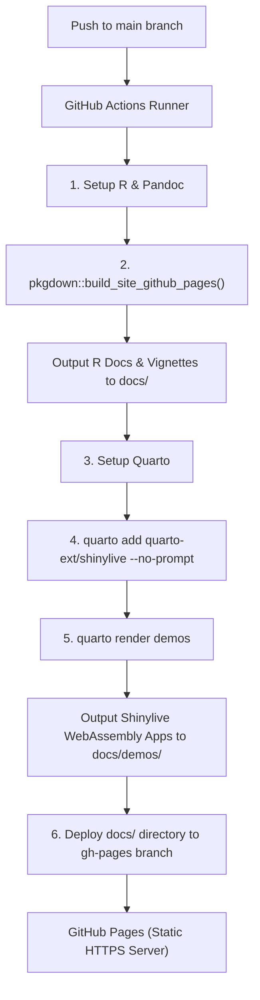

# GitHub Actions & Shinylive Publishing Documentation

This document describes the automated deployment workflow, configuration, and troubleshooting walkthrough for publishing the **ewing** package documentation, vignettes, and interactive serverless Quarto Shinylive applications via GitHub Actions to GitHub Pages.

---

## 1. Published URLs Overview

When pushed to the repository's `main` branch, GitHub Actions builds and publishes the package site to GitHub Pages at the following locations:

| Section | URL | Description |
| :--- | :--- | :--- |
| **Main Site & Vignettes** | `https://byandell.github.io/ewing/` | Main `pkgdown` package documentation, function reference, and R vignettes (`articles/ewing.html`). |
| **Demos Gallery Index** | `https://byandell.github.io/ewing/demos/index.html` | Interactive gallery homepage listing serverless WebAssembly Shinylive applications. |
| **fivePlotApp (Shinylive)** | `https://byandell.github.io/ewing/demos/fivePlotApp.html` | Interactive WebAssembly explorer for studying single-parameter sensitivity of spline curves using `five.plot()`. |
| **fiveShowApp (Shinylive)** | `https://byandell.github.io/ewing/demos/fiveShowApp.html` | Interactive WebAssembly explorer for target relative mean searches using `five.show()`. |

---

## 2. User Prompts & Technical Diagnosis

### Initial Problem Statement
> *"demos/fivePlotApp.qmd and demos/fiveShowApp.qmd spin up but do not render properly. Where there should be the app, there is code. It begins with '| '!! shinylive warning !!': | #| shinylive does not work in self-contained HTML documents. #| Please set `embed-resources: false` in your metadata."*

### Concerns & Clarifications
> *"Challenge with plan is that I don't want to upload shinylive resources--I want that to be done server side. Is that what we are doing? Concerned about setting embed-resources to false."*

### Root Cause Diagnosis
1. **Shinylive WASM Execution Requirements**: Shinylive uses browser WebAssembly (`webR`) and service workers (`shinylive-sw.js`). Modern browser security models block WebWorkers from executing inside self-contained data URIs (`embed-resources: true`).
2. **Quarto Shinylive Lua Filter Warning**: When `quarto preview` or `quarto render` runs in self-contained HTML mode (or when `--embed-resources` is passed), the Shinylive Lua filter outputs a fallback code block starting with `#| '!! shinylive warning !!': |`.
3. **Repository Cleanliness vs. CI/CD Build**:
   - Setting `embed-resources: false` instructs Quarto to produce standard web assets (`.html`, `.js`, `.css`) during compilation.
   - All generated build files (`docs/`, `demos/_extensions/`, `demos/.quarto/`) are listed in `.gitignore` and **are never tracked or committed** to the source repository (`main` branch).
   - Building and packaging of Shinylive assets is performed entirely **server-side on GitHub Actions** during the deployment workflow.

---

## 3. Architecture & GitHub Actions Workflow

The automated deployment pipeline is defined in [.github/workflows/pkgdown.yaml](file:///Users/brianyandell/Documents/Research/ewing/ewing/.github/workflows/pkgdown.yaml).



### GitHub Actions Step Breakdown

```yaml
name: pkgdown.yaml

on:
  push:
    branches: [main, master]
  workflow_dispatch:

jobs:
  pkgdown:
    runs-on: ubuntu-latest
    permissions:
      contents: write
    steps:
      - uses: actions/checkout@v6

      - uses: r-lib/actions/setup-pandoc@v2
      - uses: r-lib/actions/setup-r@v2

      - uses: r-lib/actions/setup-r-dependencies@v2
        with:
          extra-packages: any::pkgdown, local::.
          needs: website

      # Step 1: Build pkgdown site and vignettes into docs/
      - name: Build site
        run: pkgdown::build_site_github_pages(new_process = FALSE, install = FALSE)
        shell: Rscript {0}

      # Step 2: Setup Quarto
      - name: Set up Quarto
        uses: quarto-dev/quarto-actions/setup@v2

      # Step 3: Install Shinylive extension dynamically on server runner
      - name: Render Quarto Demos
        run: |
          quarto add quarto-ext/shinylive --no-prompt
          quarto render demos
        shell: bash

      # Step 4: Publish docs/ folder to gh-pages branch
      - name: Deploy to GitHub pages 🚀
        if: github.event_name != 'pull_request'
        uses: JamesIves/github-pages-deploy-action@v4.8.0
        with:
          clean: false
          branch: gh-pages
          folder: docs
```

---

## 4. Configuration Reference

### A. Quarto Site Metadata ([demos/_quarto.yml](file:///Users/brianyandell/Documents/Research/ewing/ewing/demos/_quarto.yml))
```yaml
project:
  type: website
  output-dir: ../docs/demos

website:
  title: "ewing Demos"
  navbar:
    left:
      - href: index.qmd
        text: Home
      - href: fivePlotApp.qmd
        text: fivePlotApp
      - href: fiveShowApp.qmd
        text: fiveShowApp
    right:
      - icon: github
        href: https://github.com/byandell/ewing

format:
  html:
    theme: cosmo
    toc: true
    toc-depth: 2
    embed-resources: false
    self-contained: false

filters:
  - shinylive
```

### B. Application Document Frontmatter ([demos/fivePlotApp.qmd](file:///Users/brianyandell/Documents/Research/ewing/ewing/demos/fivePlotApp.qmd))
```yaml
---
title: "fivePlotApp (Shinylive)"
description: "A serverless WebAssembly-powered explorer to study single parameter sensitivity of spline curves using five.plot()."
author: "Brian S. Yandell"
toc: false
format:
  html:
    embed-resources: false
---
```

### C. Pkgdown Navigation Link ([_pkgdown.yml](file:///Users/brianyandell/Documents/Research/ewing/ewing/_pkgdown.yml))
```yaml
navbar:
  components:
    articles:
      text: Guides
      menu:
        - text: "User Guides"
        - text: "Tutorial Vignette"
          href: articles/ewing.html
        - text: "Demos Gallery"
          href: demos/index.html
```

---

## 5. Local Testing & Verification

To build and preview the demos locally:

1. Render the Quarto project:
   ```bash
   quarto render demos
   ```
2. Serve the `docs/` output directory over HTTP (Shinylive WebWorkers require HTTP/HTTPS serving and cannot be opened via `file://` protocols):
   ```bash
   python3 -m http.server 8000 --directory docs
   ```
3. Navigate to `http://localhost:8000/demos/index.html` in your browser.
