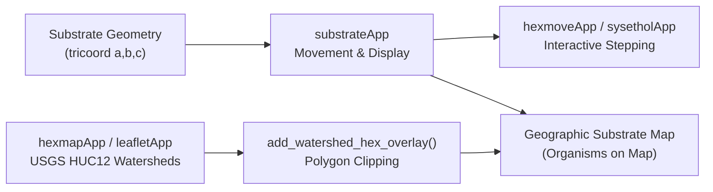

# Substrate Movement on Map (`substrateApp`)

## Overview

The primary goal of this refactoring pipeline is to utilize **`substrateApp`** (`substrateInput`, `substrateOutput`, `substrateServer`) to track and simulate organism movement across substrate grid networks, establishing a foundation to project host and parasite spatial positions onto real-world geographic maps identified with **`hexmapApp`**.

---

## Modular Integration Milestones

### 1. `sysetholApp` Integration (`R/sysetholApp.R`)
- **Sidebar Composition**: Replaced simplified/duplicated species display controls in `sysetholInput` with **`substrateInput("substrate")`**. Users can now adjust layout views (Hex Substrate Overlay vs Faceted Substrates), species modes (Overlay vs Separate), step densities, substrate radii, display layers (boundaries, hex grid, organisms, labels), and incremental step buttons directly within the Systems Ethology Platform.
- **Output Tab Composition**: Updated `sysetholOutput` to embed **`substrateOutput("substrate")`** inside the **Substrate Plots** tab.
- **Server Module Delegation**: Replaced ~45 lines of custom plotting code in `sysetholServer` with a clean call to **`substrateServer("substrate", simres = current_sim)`**.

### 2. `hexmoveApp` Modularization (`R/hexmoveApp.R`)
- **Exported Module Components**: Added and exported `hexmoveAppInput()`, `hexmoveAppOutput()`, and `hexmoveAppServer()` in `R/hexmoveApp.R` and `NAMESPACE`.
- **Composable App Launcher**: Re-architected `hexmoveApp()` to compose its sidebar and main panel directly from `hexmoveAppInput`, `hexmoveAppOutput`, and `hexmoveAppServer`, cleanly delegating spatial grid stepping and plotting to `substrateServer`.

### 3. Shinylive WebAssembly Demos (`demos/`)
- **`demos/sysetholApp.qmd`**: Expanded `inc_files` to include `R/ewing_substrate.R`, `R/substrate_triangle.R`, and `R/substrateApp.R` alongside `R/inputApp.R` and `R/sysetholApp.R` so client-side WebAssembly execution in Shinylive has complete access to substrate geometry rendering functions.
- **`demos/hexmoveApp.qmd`**: Confirmed standalone Shinylive code generation utilizing `hexmoveAppInput` and `hexmoveAppOutput`.

---

## Strategic Roadmap: Spatial Movement on Geographic Hexmaps

1. **Phase 1 (Completed)**: Standardize `substrateApp` as the central organism movement visualizer and module across `sysetholApp` and `hexmoveApp`.
2. **Phase 2 (Next Step)**: Map tridiagonal triangular coordinates $(a, b, c)$ from `substrateApp` to geographic latitude/longitude polygons generated by `hexmapApp` (`R/hexmapApp.R`, `R/watershed_overlay.R`).
3. **Phase 3**: Implement dynamic organism movement animation over watershed boundaries with spatial density overlays on real-world GIS features (e.g., Isle Royale USGS HUC12 subwatersheds).
