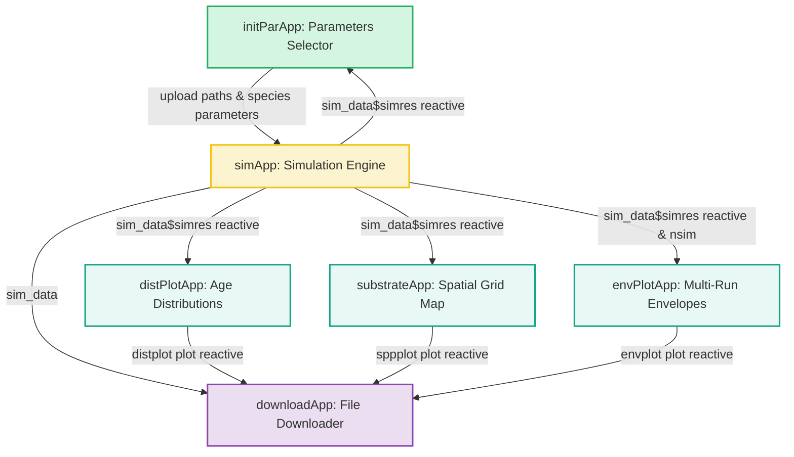

This document details the high-level software architecture and interactive reactivity design patterns of the **ewing** Shiny application dashboard. It explains how independent component modules communicate state and route simulation data dynamically.

---

## 1. Modular Communication Structure

The dashboard layout and server linkages are defined in [R/ewingApp.R](file:///Users/brianyandell/Documents/Research/ewing/ewing/R/ewingApp.R). Rather than a monolithic codebase, the interface is split into dedicated Shiny modules using `moduleServer()`.

Below is the state communication and data flow diagram:



### Server Coordination (`ewingServer`)

The coordinating server loop in [ewingServer()](file:///Users/brianyandell/Documents/Research/ewing/ewing/R/ewingApp.R#L31) maps these interactions explicitly:
```r
ewingServer <- function(id) {
  shiny::moduleServer(id, function(input, output, session) {
    ns <- session$ns
    
    # 1. Initialize Parameters Table & Species Models
    init_par <- initParServer("init_par", simres = shiny::reactive({ tryCatch(sim_data$simres(), error=function(e) NULL) }))
    
    # 2. Main Run Simulation 
    sim_data <- simServer("sim", init_par)
    
    # 3. Dynamic Visualizations (Evaluating on active state)
    dist_plot <- distPlotServer("dist_plot", sim_data$simres)
    spp_plot <- substrateServer("substrate", sim_data$simres)
    env_plot <- envPlotServer("env_plot", sim_data$simres, sim_data$nsim)
    
    # 4. Bind the File Extractor
    downloadServer("download", sim_data = sim_data, distplot = dist_plot, sppplot = spp_plot, envplot = env_plot)
    ...
  })
}
```

---

## 2. UI Layout & Dynamic Tabs

The user interface uses [bslib::page_sidebar()](file:///Users/brianyandell/Documents/Research/ewing/ewing/R/ewingApp.R#L14) to build a split-frame responsive layout:
- **Global Sidebar**: Contains panels from [initParInput()](file:///Users/brianyandell/Documents/Research/ewing/ewing/R/initParApp.R), [simInput()](file:///Users/brianyandell/Documents/Research/ewing/ewing/R/simApp.R), [distPlotInput()](file:///Users/brianyandell/Documents/Research/ewing/ewing/R/distPlotApp.R), [envPlotInput()](file:///Users/brianyandell/Documents/Research/ewing/ewing/R/envPlotApp.R), and [downloadInput()](file:///Users/brianyandell/Documents/Research/ewing/ewing/R/downloadApp.R).
- **Dynamic Main Panel**: The active tabs change dynamically based on the value of `nsim` chosen by the user.

```r
# Dynamic tab builder in R/ewingApp.R
output$dynamic_tabs <- shiny::renderUI({
  sims <- shiny::req(sim_data$nsim())
  if (sims == 1) {
    bslib::navset_tab(
      bslib::nav_panel("Dist Plots", distPlotOutput(ns("dist_plot"))),
      bslib::nav_panel("Substrate Plots", bslib::card(substrateOutput(ns("substrate")))),
      bslib::nav_panel("Input Data", initParOutput(ns("init_par")))
    )
  } else {
    bslib::navset_tab(
      bslib::nav_panel("Envelope Plots", bslib::card(envPlotOutput(ns("env_plot")))),
      bslib::nav_panel("Input Data", initParOutput(ns("init_par")))
    )
  }
})
```

---

## 3. Data Flow and Module API Bindings

| Module | Exposed Reactive Outputs | Subscribed Inputs |
|---|---|---|
| **Parameters (`initPar`)** | - `host`: Initial host count<br>- `parasite`: Initial parasite count<br>- `datafile`: Selected Excel filepath | - `simres`: Active simulation result for DT visualization |
| **Simulation (`sim`)** | - `simres`: The `ewing` or `ewing_discrete` run output<br>- `nsim`: Selected number of simulation runs | - `init_par`: Config state list |
| **Age Distributions (`distPlot`)** | - `distplot`: The active ggplot age overlay object | - `simres`: Main single-run results |
| **Spatial Substrate (`substrate`)** | - `sppplot`: The active ggplot individual positions grid | - `simres`: Main single-run results |
| **Envelope Bounds (`envPlot`)** | - `envplot`: The active ggplot confidence boundary | - `simres`: Multi-run discrete data |
| **Downloads (`download`)** | - (None, output is written directly to disk via user click triggers) | - `sim_data`: Contains run metrics<br>- `distplot`, `sppplot`, `envplot` reactives |

For deep dives into each section, see:
- [Simulation Panels](./simulation.html)
- [Visualization Panels](./visualization.html)
- [Utilities & Download Controls](./utilities.html)
