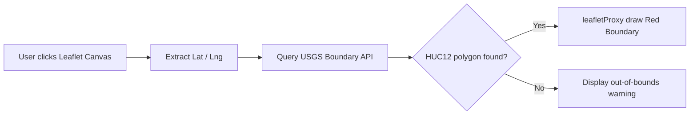

This sub-guide covers the data downloader module (`downloadApp`), the interactive GIS Leaflet mapping module (`leafletApp`), and the developer debug apps (`futureApp` and `initApp`).

---

## 1. Export Data and Plots (`downloadApp`)

Defined in [R/downloadApp.R](file:///Users/brianyandell/Documents/Research/ewing/ewing/R/downloadApp.R), this utility module bridges visual panels to physical disk storage, exporting data tables as CSV files and graphs as vector PDF documents.

### Safe Device Closures (`on.exit`)
To prevent the application from freezing or keeping open file locks on the host filesystem when a plot rendering crashes, the server employs `on.exit()` to guarantee cleanup:

```r
content = function(file) {
  grDevices::pdf(file, width = 9)
  # Lock release is guaranteed to fire regardless of runtime errors
  on.exit(grDevices::dev.off(), add = TRUE)
  
  nsim <- as.integer(shiny::req(sim_data$nsim()))
  if(nsim == 1) {
    print(shiny::req(distplot()))
    ...
  }
}
```

### Export Outputs
- **Run data CSV**: Extracts time series counts using [readCount()](file:///Users/brianyandell/Documents/Research/ewing/ewing/R/fileCount.R) for single runs or retrieves confidence limits from envelopes for multi-runs.
- **Plot PDF**: Saves a PDF of the age distribution and spatial plots (`nsim == 1`) or the multi-run confidence envelope plot (`nsim > 1`).

---

## 2. Interactive Map Explorer (`leafletApp`)

Defined in [R/leafletApp.R](file:///Users/brianyandell/Documents/Research/ewing/ewing/R/leafletApp.R), this module integrates spatial GIS capabilities into individual-based population tracking.

### Boundary Discovery Flow
The map explorer tracks user mouse clicks on the canvas and performs dynamic reverse-geocoding:



### Key Functions
- `build_base_map()`: Spawns the default OpenStreetMap layer.
- `get_huc_from_point(lng, lat)`: Accesses external USGS Web Feature Services to fetch the local HUC12 shapefile.
- `leafletProxy("mapper")`: Redraws and clears polygons dynamically without re-rendering the entire base map.

---

## 3. Developer Test Applications

To aid in debugging specific parts of the codebase, two lightweight companion apps are included:

### A. Initialization Inspector (`initApp`)
Defined in [R/initApp.R](file:///Users/brianyandell/Documents/Research/ewing/ewing/R/initApp.R), this app isolates and inspects the community topology right after creation:
- Triggers [init.simulation()](file:///Users/brianyandell/Documents/Research/ewing/ewing/R/init.simulation.R) on the inputs.
- Displays summary statistics on individuals, stages, and species using [summary_simobj()](file:///Users/brianyandell/Documents/Research/ewing/ewing/R/summary_simobj.R).
- Renders the initial substrate layout to check spatial placement correctness.

### B. Event Horizon Inspector (`futureApp`)
Defined in [R/futureApp.R](file:///Users/brianyandell/Documents/Research/ewing/ewing/R/futureApp.R), this app bypasses multi-run simulations to evaluate deterministic event queue behavior:
- Runs [future.events()](file:///Users/brianyandell/Documents/Research/ewing/ewing/R/future.events.R) directly on the starting community.
- Inspects continuous event horizons.
- Renders age classes and substrate coordinates to verify state transition calculations.

### C. Spline Parameter Explorer (`fivePlotApp`)
Defined in [R/fivePlotApp.R](file:///Users/brianyandell/Documents/Research/ewing/ewing/R/fivePlotApp.R), this app allows interactive, web-safe adjustment of time-temperature spline nodes:
- Uses a point-click listener on the baseline plot rather than R console's blocking `graphics::locator()`.
- Calculates closest nodes to click positions, modifying them subject to monotonicity boundaries.
- Triggers dynamic, real-time recalculation of parameter sensitivity curves via [five.plot()](file:///Users/brianyandell/Documents/Research/ewing/ewing/R/five.R#L151).
- Synchronizes values bi-directionally between graphical plot clicks and text input controls.

### D. Spline Goal Explorer (`fiveShowApp`)
Defined in [R/fiveShowApp.R](file:///Users/brianyandell/Documents/Research/ewing/ewing/R/fiveShowApp.R), this companion explorer app targets binary-search goal calculations:
- Shares the click-to-move interactive baseline spline editor UI.
- Implements a goal-target numeric/slider input to choose target relative mean times.
- Runs and displays [five.show()](file:///Users/brianyandell/Documents/Research/ewing/ewing/R/five.R#L97) plots showing target adjustments for all five parameters.
- Captures console output of binary search details using `utils::capture.output()` and renders it on a card.


